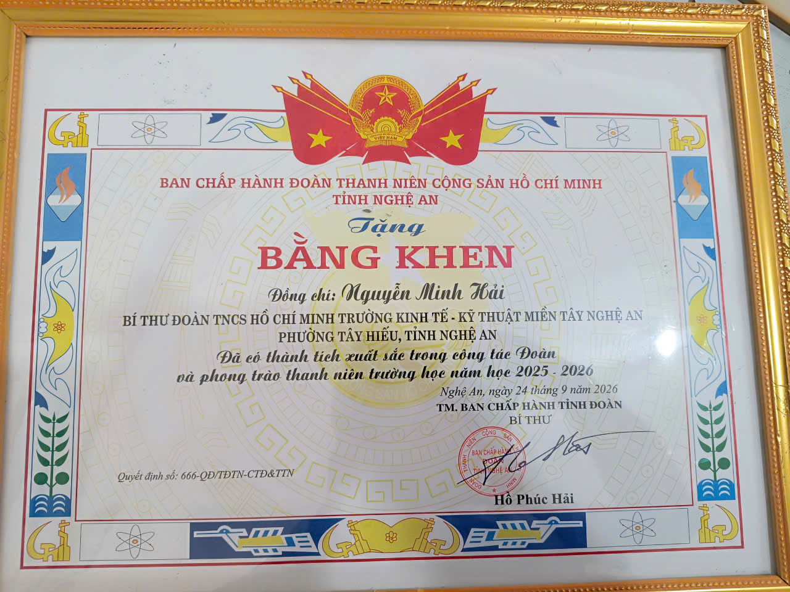

# Cổng thông tin điện tử – Công tác Đoàn & Quản lý nề nếp học sinh

## Giới thiệu
Đây là sản phẩm **Đồ án học phần Nhập môn Công nghệ thông tin**
trường Đại học Vinh, do sinh viên **NGUYỄN MINH HẢI – lớp K66-CNTT - MSSV: 254748020190034** thực hiện.
Website tập hợp quy trình giao ban, quy trình kiểm tra nề nếp, nội quy an toàn
giao thông và kênh phản hồi, phục vụ công tác Bí thư Đoàn Thanh niên.

> Mục tiêu: Giúp cán bộ Đoàn, giáo viên và học sinh tra cứu quy trình, nội quy
> một cách nhanh chóng, thống nhất; tiếp nhận ý kiến phản hồi trực tuyến.

## Cấu trúc website
| STT | Trang | Nội dung chính |
|-----|-------|----------------|
| 1 | Trang chủ (README.md) | Giới thiệu, mục tiêu, cấu trúc |
| 2 | Giới thiệu | Tổng quan về cổng thông tin |
| 3 | Quy trình giao ban | Quy trình giao ban đầu giờ |
| 4 | Kiểm tra nề nếp | Nội dung kiểm tra, quy trình |
| 5 | ATGT và nội quy | Quy định an toàn giao thông, nội quy |
| 6 | Gửi phản hồi | Biểu mẫu phản hồi (Google Form) |

## Công nghệ sử dụng
- GitHub Pages (hosting tĩnh miễn phí)
- Docsify (trình bày tài liệu Markdown)
- Plugin: Search, Copy-code
- Tích hợp: Google Form (iframe)

## Link sản phẩm
- Website đang chạy: https://nguyenhai-cntt-dhv.github.io/cong-tac-doan-ne-nep-hoc-sinh/
- Kho chứa GitHub: https://github.com/nguyenhai-cntt-dhv/cong-tac-doan-ne-nep-hoc-sinh

## Tác giả
**Nguyễn Minh Hải** – Lớp K66-CNTT – MSSV: 254748020190034
Giảng viên hướng dẫn: NGUYỄN THÚY HÒA – Khoa Kỹ thuật Công nghệ, Trường Đại học Vinh

